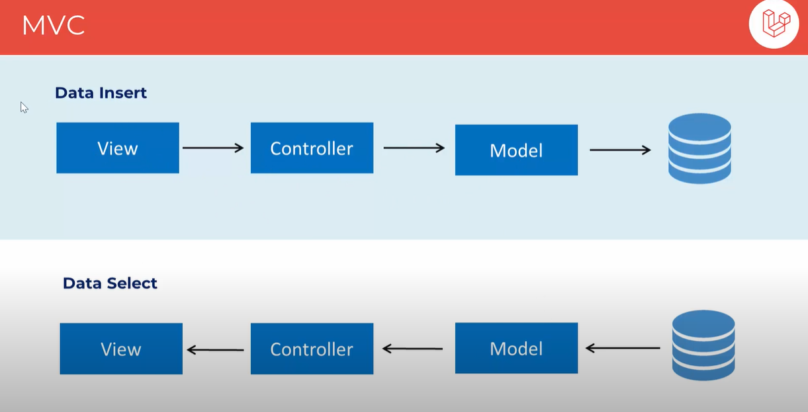

## Draft Note Section

START: Draft Note Section

**_এই নোটের প্রতিটা টপিক যখন তার নিজ নিজ Chapter এ সুন্দর করে লিখা শেষ হয়ে যাবে, তখন এই Draft Note Section Delete করে দিতে হবে_**

### MVC

- MVC(Model View Controller): Software কে তিনভাগ করে বা Source Codes কে তিনভাগ করে Develop করার পদ্ধতি। MVC ছাড়াও আরও অনেক পদ্ধতি আছে।
- Model = Data Structure, View = The Visible Part of The Application, Controller = Logics of The Application. View এবং Model এর মাঝে Controller via হয়ে কাজ করে। Controller একটা Bridge এর মতো কাজ করতেছে। Controller এর সাথে View এবং Model এর সরাসরি সম্পর্ক আছে, কিন্তু View এর সাথে Model এর কোন সরাসরি সম্পর্ক নেই।

- Laravel এ `route/web.php` file এ Route এর Defination লিখা হয়।

### @csrf

- @csrf directive, CSRF টোকেন ধারণকারী একটি hidden input field তৈরি করে। এই hidden input field টি স্বয়ংক্রিয়ভাবে ফর্মটিতে অন্তর্ভুক্ত হয় যখন এটি রেন্ডার করা হয়।
- যখন কোন User ফর্মটি জমা দেয়, তখন ফর্ম ডেটা সহ CSRF টোকেন পাঠানো হয়।
- Laravel মিডলওয়্যার Request টি বৈধ কিনা তা নিশ্চিত করতে সেশনে সংরক্ষিত টোকেন এর সাথে submitted token পরীক্ষা করে।

END: Draft Note Section

# Chapter-01:

# Learn Laravel in 30 Chapters

### After completing this course, we'll build [5 Projects](#) with Laravel.

While you complete the 30-chapter module, jump in the [Projects Section](#).

|                                         Chapter                                         |                                        Topics                                         | Video Explanation |
| :-------------------------------------------------------------------------------------: | :-----------------------------------------------------------------------------------: | :---------------: |
|                      [00](#chapter-00-how-the-course-is-designed)                       |                      [How the course is designed](#chapter-00-how-the-course-is-designed)                       |   [Watch Now]()   |
| [01](#chapter-01-what-is-nextjs-features-of-nextjs-environment-setup-project-structure) |  |   [Watch Now]()   |
|                 [02](#chapter-02-html-quotation-link-image-and-favicon)                 |                                  |     Watch Now     |
|    [03](#chapter-03-html-table-list-iframes-code-tag-semantic-element-and-entities)     |         |     Watch Now     |
|                [04](#chapter-04-html-symbols-emojis-charsets-and-forms)                 |                                 |     Watch Now     |
|                    [05](#chapter-05-html-canvas-svg-and-html-media)                     |                                         |     Watch Now     |
|      [06](#chapter-06-introduction-to-css-css-selectors-ways-of-styling-and-color)      |            |     Watch Now     |
|                                           07                                            |                                                                                       |     Watch Now     |
|                                           08                                            |                                                                                       |     Watch Now     |
|                                           09                                            |                                                                                       |     Watch Now     |
|                                           10                                            |                                                                                       |     Watch Now     |
|                     [11](#chapter-11-css-position-z-index-overflow)                     |                                          |     Watch Now     |
|                      [12](#chapter-12-css-float-display-alignment)                      |                                            |     Watch Now     |
|                              [13](#chapter-13-css-flexbox)                              |                                                            |     Watch Now     |
|                             [14](#chapter-14-css-selectors)                             |                                                          |     Watch Now     |
|                         [15](#chapter-15-css-text-fonts--icons)                         |                                                  |     Watch Now     |
|               [16](#chapter-16-css-links-lists-tables-display--max-width)               |                              |     Watch Now     |
|                  [17](#chapter-17-css-image-gallery-and-image-sprites)                  |                                    |     Watch Now     |
|                                           18                                            |                                                                                       |     Watch Now     |
|                [19](#chapter-19-visualize-and-play-with-css-properties)                 |                                 |     Watch Now     |
|                            [20](#chapter-20-css-grid-layout)                            |                                                        |     Watch Now     |
|                             [21](#chapter-21-css-gradient)                              |                                                           |     Watch Now     |
|                       [22](#chapter-22-css-2d-and-3d-transforms)                        |                                               |     Watch Now     |
|                            [23](#chapter-23-css-animations)                             |                                                                                   |     Watch Now     |
|                                           24                                            |                                                                                       |     Watch Now     |
|                                           25                                            |                                                                                       |     Watch Now     |
|                                           26                                            |                                                                                       |     Watch Now     |
|                                           27                                            |                                                                                       |     Watch Now     |
|                                           28                                            |                                                                                       |     Watch Now     |
|                                           29                                            |                                                                                       |     Watch Now     |
|                                           30                                            |                                                                                       |     Watch Now     |

# 5 NextJS Projects

|                     Project No.                      |                    Project Name                    | Video Explanation |   Live Demo   |
| :--------------------------------------------------: | :------------------------------------------------: | :---------------: | :-----------: |
|                          01                          |                                                    |     Watch Now     |   Live Demo   |
|  [02](#project-02-simple-website-layout-with-float)  |    |     Watch Now     |   Live Demo   |
| [03](#project-03-simple-website-layout-with-flexbox) |  |     Watch Now     |   Live Demo   |
|                          04                          |                                                    |     Watch Now     |   Live Demo   |
|      [05](#project-05-simple-3d-animation-page)      |            |  [Watch Now](#)   | [Live Demo]() |

# Chapter-00: How The Course is Designed

### কোর্সটি যেভাবে সাজানো হয়েছেঃ

- এই পুরো Article কে একটা বই মনে করতে পারেন। কোর্সটি 30 টি Chapter এ ভাগ করা হয়েছে। প্রতিটি Chapter এ Next.js এর বিভিন্ন Topics নিয়ে আলোচনা করা হয়েছে।
- প্রতিটা Chapter এর Module সাজানো হয়েছে ক্রমানুসারে । উদাহরণস্বরূপ, Chapter-05 এর টপিকসগুলো শিখতে হলে অবশ্যই আপনাকে Chapter-04 শেষ করে আসতে হবে। একইভাবে Chapter-04 শিখতে হলে আপনাকে Chapter-03 শেষ করে আসতে হবে ।
- প্রতিটা Chapter এর Topics এর Written Documentation/Explanation এর সাথে সাথে Video Explanation-ও দেয়া আছে। যাতে শিক্ষার্থীরা খুব সহজেই টপিকসগুলো আত্মস্থ করতে পারে।

### কোর্সটি কাদের জন্য?

- এই কোর্সটিতে যেকেউ অংশগ্রহণ করতে পারবে। শিখার জন্য মনের ইচ্ছাটাই আসল!
- Course টি মূলত Beginner-friendly.

### Prerequisite

- Basic of PHP

    <b><a href="#learn-laravel-in-30-chapters">↥ Go to Top</a></b>

# Chapter-01: What is Laravel, Why Laravel, Features of Laravel Environment Setup, Creating First Project, MVC Design Pattern

- [What is Laravel](#what-is-laravel)
- [Why Laravel]()

## What is Laravel
- Laravel হলো একটি Free এবং Open Source এর PHP Web Framework।
- এটি Taylor Otwell(টেলর অটওয়েল) দ্বারা তৈরি করা হয়েছিল। 2011 সালে প্রথম Laravel Released করা হয়।
- লারাভেল মডেল-ভিউ-কন্ট্রোলার (MVC) আর্কিটেকচারাল প্যাটার্ন অনুসরণ করে, যা More Organized and Structured Way তে Developers দের Code করতে সাহায্য করে।

## Why Laravel

1. পৃথিবীতে সমস্ত Website এর 77% Website PHP দিয়ে তৈরি করা।
2. MVC(Model View Controller) Design Pattern.
3. যেকোনো Software এর Backend হিসেবে Laravel ব্যবহার করা যায়। সেটা হতে পারে Web Application, Mobile App, Desktop Application, IOT Device ইত্যাদি।
4. একই Code ব্যবহার করে ভিন্ন ভিন্ন Database (যেমনঃ MySQL, MS SQL, SQLite) এর সাথে Communicate করা যায়। 

    <b><a href="#learn-laravel-in-30-chapters">↥ Go to Top</a></b>

# Project-01: Simple Website Layout with Float

### Difficulty: Easy (2/10)

### You Will Learn

- কিভাবে একটি Website এর Layout তৈরি করতে হয় শুধুমাত্র HTML and CSS এর Basic Concept দ্বারা ও float দ্বারা ।

### Project Description

এই প্রজেক্টে আমরা একটা Simple Website Layout বানাবো CSS এর Basic Concept ও Float ব্যবহার করে।

### Project Screenshot

_Click the following image to view Project_

### Live Project Link

[Open in CodePen](https://codepen.io/travelerabdulalim/pen/QWrrWgV)

### Video Explanation

Coming Soon...

### Project Source Codes

[Source Codes](./project-02-simple-website-layout-with-basic-css/)
